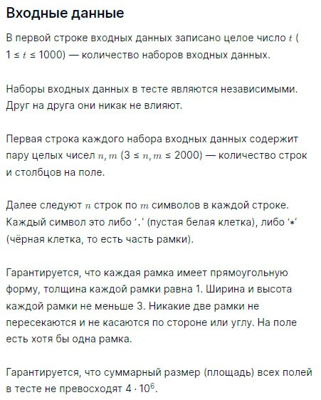

# Задача для озон контеста: [Рамки]

## Условие задачи

## Решение
Достаточно интересная задача, основной сложностью в которой стало ограничение по времени в три секунды. Изначально задачу решал [мой друг](https://github.com/S0IG0), используя язык python. У него не получилось преодолеть ограничение на работу программы в 3 секунды, несколько тестов очень долго проходили, вплоть до 100 секунд. В поиске новых идей он обратился ко мне. Коллективно придумали много вариаций алгоритма, пока не пришли к самому оптимизированному варианту:

1 Считываем изначальную матрицу, превращаем все точки в 0, все звездочки в 1

2 Выполняем рекурсивный поиск по заданной области (первый вызов происходит ): 

  2.1. Как только находим новую рамку, находим её левый верхний и правый нижний углы, присваиваем индекс (начинаем с двойки, т.к. 1 и 0 заняты)

  2.2. Меняем символы границы рамки с 1 на её индекс

  2.3. Заносим пару Индекс рамки-Длина рамки в хеш-таблицу. Эта таблица нужна для экономии времени, т.к. если мы встречаем уже известную рамку, то просто обращаемся к хеш-таблице и выполняем сдвиг вперед на длину рамки.

  2.4. Сохраняем текущий уровень вложенности в лист с ответами, который потом отсортируем и выведем

  2.5. Если матрица маленькая или если внутри области новых матриц не обнаружено, понижаем уровень вложенности, возвращаемся

  2.6. Если предыдущий пункт не выполнен, снова вызываем функцию поиска внутри найденной рамки
Функция проходит по всем рамкам, в каждую рекурсивно спускается и все отмечает. На рисунках наглядно показан результат работы программы:

  

*Матрица после всех преобразований:*

## Запуск проекта:
1. Склонируйте репозиторий: `git clone https://github.com/Lefski/Frames.git`
2. Сборка jar файла: в консоли в директории проекта `mvn clean package`
3. Запуск приложения: `Get-Content .\testFiles\ХХХ | java -jar .\target\Frames-1.0-SNAPSHOT.jar ` вместо ХХХ номер теста, от 1 до 75
4. Чтобы прогнать все тесты ` .\RunTestFiles.ps1`

**Примечание:** Убедитесь, что у вас установлены java+maven перед запуском проекта.
